# Agenting Engineering

Does code matter?

> **Last Updated:** 2026-05-02

**AI TERMS:**

| | | | | |
|---|---|---|---|---|
| Agentic Engineering | AI Slop | Context Bloat | Context Engineering | Context Rot |
| Dumb Zone | Hallucination | Scaffolding | Orchestration | Vibe Coding |

[**See Complete List →**](/reports/ai-terms.md)

## Context Window Comparison

| Tool | Largest Context | Best Model | Input $/M | Output $/M | Source |
|------|-----------------|------------|-----------|------------|--------|
| Claude Code | 1M (GA) | Opus 4.7 | $5.00 | $25.00 | [Anthropic Models](https://platform.claude.com/docs/en/about-claude/models/overview) |
| Codex CLI | 1M (API) / 400k (Codex cap) | GPT-5.5 | TBD* | TBD* | [OpenAI Codex Models](https://developers.openai.com/codex/models) |
| Cursor | 2M (Max Mode) | Grok 4.20 | $3.00** | $15.00** | [Cursor Models](https://cursor.com/docs/models) |
| Gemini CLI | 1M | Gemini 3.1 Pro Preview | $2.00 | $12.00 | [Gemini API](https://ai.google.dev/gemini-api/docs/models) |

[**See Complete List →**](reports/context-comparison.md)
